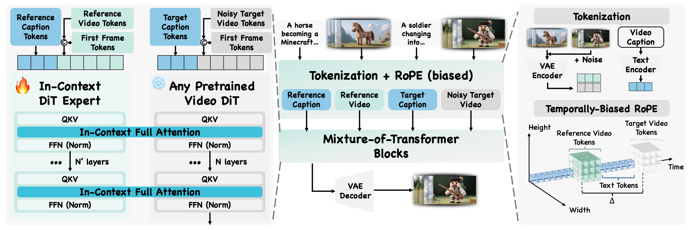

<div align="center">

# Video-As-Prompt: Unified Semantic Control for Video Generation

</div>


<div align="center">
  <a href=https://bytedance.github.io/Video-As-Prompt target="_blank"></a>
  <a href=https://huggingface.co/collections/ByteDance/video-as-prompt target="_blank"></a>
  <a href=https://huggingface.co/datasets/BianYx/VAP-Data  target="_blank"></a>
  <a href=https://github.com/bytedance/Video-As-Prompt target="_blank"></a>
  <a href=https://arxiv.org/pdf/2510.20888 target="_blank"></a>
  <!-- <a href=https://yxbian23.github.io/ target="_blank"></a> -->
  <!-- <a href="https://opensource.org/licenses/Apache">
    
  </a> -->
  <a href="https://www.youtube.com/watch?v=S3zpLIMOU4c" target="_blank">
    
  </a>
</div>

<br>

## 🔥 News

- Oct 24, 2025: 📖 We release the first unified semantic video generation model, [Video-As-Prompt (VAP)](https://github.com/bytedance/Video-As-Prompt)!
- Oct 24, 2025: 🤗 We release the [VAP-Data](https://huggingface.co/datasets/BianYx/VAP-Data), the largest semantic-controlled video generation datasets with more than $100K$ samples!
- Oct 24, 2025: 👋 We present the [technical report](https://arxiv.org/pdf/2510.20888) of Video-As-Prompt, please check out the details and spark some discussion!

      

## 🖌️ **Video-As-Prompt**

> **Core idea:** Given a reference video with wanted semantics as a video prompt, Video-As-Prompt animate a reference image with the same semantics as the reference video.
<p align="center">
  <video
    controls
    autoplay
    playsinline
    muted
    loop
    src="https://github.com/user-attachments/assets/2e440927-5b16-4761-ad1f-46ac93de2d8e"
    width="100%"
  >
    Your browser does not support HTML5 video. Here is a <a href="https://github.com/user-attachments/assets/2e440927-5b16-4761-ad1f-46ac93de2d8e">link to the video</a> instead.
  </video>
  <br>
  <em>E.g., Different Reference Videos + Same Reference Image → New Videos with Different Semantics</em>
</p>


> **Welcome to see our [project page](https://bytedance.github.io/Video-As-Prompt) for more interesting results!**


### Architecture
We introduce **Video-As-Prompt (VAP)**, a new paradigm that reframes unified and generalizable semantic-controlled video generation as in-context generation. VAP leverages a reference video as a direct semantic prompt, guiding a frozen Video Diffusion Transformer (DiT) via a plug-and-play Mixture-of-Transformers (MoT) expert. This architecture prevents catastrophic forgetting and is guided by a temporally biased position embedding that eliminates spurious mapping priors for robust context retrieval. As a single unified model, VAP sets a new state-of-the-art for open-source methods, achieving a **38.7\% user preference rate** that rivals leading condition-specific commercial models. VAP's strong zero-shot generalization and support for various downstream applications mark a significant advance toward general-purpose, controllable video generation.

<p align="left">
  
</p>

### Performance

We have evaluated **Video-As-Prompt (VAP)** with other open-source as well as close-source commercial models (Kling / Vidu). The numerical results indicate that Video-As-Prompt (VAP) surpasses all non-unified baselines under various semantic conditions as **the first unified and generalizable semantic-controlled video generation model!**

| Model                   | Clip Score(⬆)   | Motion Smoothness(⬆) | Dynamic Degree(⬆) | Aesthetic Quality(⬆) | Alignment Score(⬆) | Preference Rate(⬆) |
|-------------------------|-----------|-------------|-------------|---------------|---------------|---------------|
| VACE (Original)  | 5.88     | 97.60      | 68.75     | 53.90         | 35.38         | 0.6         | 
| VACE (Depth) | 22.64     | 97.65      | 75.00     | 56.03         | 43.35         | 0.7         |
| VACE (Optical Flow) | 22.65     | 97.56      | **79.17**     | 57.34       | 46.71         | 1.8         |
| CogVideoX-I2V | 22.82     | 98.48      | 72.92     | 56.75         | 26.04         | 6.9         |
| CogVideoX-I2V (LoRA) | 23.59     | 98.34      | 70.83     | 54.23        | 68.60         | 13.1         |
| Kling / Vidu | 24.05     | 98.12      | **79.17**     | **59.16**         | **74.02**         | 38.2         |
| **Video-As-Prompt**           | **24.13** | **98.59**  | 77.08 | 57.71 | 70.44         | **38.7**         |


## 🎁 Models Zoo


To demonstrate cross-architecture generality, **Video-As-Prompt** provides two variants, each with distinct trade-offs:

* **`CogVideoX-I2V-5B`**

  * **Strengths:** Fewer backbone parameters let us train more steps under limited resources, yielding strong stability on most semantic conditions.
  * **Limitations:** Due to backbone ability limitation, it is weaker on human-centric generation and on concepts underrepresented in pretraining (e.g., *ladudu*, *Squid Game*, *Minecraft*).

* **`Wan2.1-I2V-14B`**

  * **Strengths:** Strong performance on human actions and novel concepts, thanks to a more capable base model.
  * **Limitations:** Larger model size reduced feasible training steps given our resources, lowering stability on some semantic conditions.

> 👏👏👏 Contributions and further optimization from the community are welcome.


| Model                      | Date       | Size | Huggingface                                                                               |
|----------------------------|------------|------|-------------------------------------------------------------------------------------------| 
| Video-As-Prompt (CogVideoX-I2V-5B)         | 2025-10-15 | 5B (Pretrained DiT) + 5B (VAP) | [Download](https://huggingface.co/ByteDance/Video-As-Prompt-CogVideoX-5B)         |
| Video-As-Prompt (Wan2.1-I2V-14B)      | 2025-10-15 | 14B (Pretrained DiT) + 5B (VAP) | [Download](https://huggingface.co/ByteDance/Video-As-Prompt-Wan2.1-14B)       |

Please download the pre-trained video DiTs and our corresponding Video-As-Prompt models, and structure them as follows
```
ckpts/
  ├── Video-As-Prompt-CogVideoX-5B/
      ├── scheduler
      ├── vae
      ├── transformer
      ├── ...
  ├── Video-As-Prompt-Wan2.1-14B/ 
      ├── scheduler
      ├── vae
      ├── transformer
      ├── ...
```

## 🤗 Get Started with Video-As-Prompt

Video-As-Prompt supports Macos, Windows, Linux. You may follow the next steps to use Video-As-Prompt via:

### Install Requirements
We test our model with Python 3.10 and PyTorch 2.7.1+cu124.
```bash
conda create -n video_as_prompt python=3.10 -y
conda activate video_as_prompt
pip install -r requirements.txt
pip install -e ./diffusers
conda install -c conda-forge ffmpeg -y
```

### Data
We have published the VAP-Data dataset used in our paper on [VAP-Data](https://huggingface.co/datasets/BianYx/VAP-Data). Please download it and put it in the `data` folder. The structure should look like:
```
data/
  ├── VAP-Data/
  │   ├── vfx_videos/
  │   ├── vfx_videos_hq/
  │   ├── vfx_videos_hq_camera/
  │   ├── benchmark/benchmark.csv
  │   ├── vap_data.csv
```


### Code Usage

We mainly implement our code based on [Diffusers](https://github.com/huggingface/diffusers) and [Finetrainers](https://github.com/huggingface/finetrainers) for their modular design.

#### Minimal Demo

Below is a minimal demo of our CogVideoX-I2V-5B variant. The full code can be found in [infer/cog_vap.py](infer/cog_vap.py). The WAN2.1-I2V-14B variant is similar and can be found in [infer/wan_vap.py](infer/wan_vap.py).
```python
import torch
from diffusers import (
    AutoencoderKLCogVideoX,
    CogVideoXImageToVideoMOTPipeline,
    CogVideoXTransformer3DMOTModel,
)
from diffusers.utils import export_to_video, load_video
from PIL import Image

vae = AutoencoderKLCogVideoX.from_pretrained("ByteDance/Video-As-Prompt-CogVideoX-5B", subfolder="vae", torch_dtype=torch.bfloat16)
transformer = CogVideoXTransformer3DMOTModel.from_pretrained("ByteDance/Video-As-Prompt-CogVideoX-5B", torch_dtype=torch.bfloat16)
pipe = CogVideoXImageToVideoMOTPipeline.from_pretrained(
    "ByteDance/Video-As-Prompt-CogVideoX-5B", vae=vae, transformer=transformer, torch_dtype=torch.bfloat16
).to("cuda")

ref_video = load_video("assets/videos/demo/object-725.mp4")
image = Image.open("assets/images/demo/animal-2.jpg").convert("RGB")
idx = torch.linspace(0, len(ref_video) - 1, 49).long().tolist()
ref_frames = [ref_video[i] for i in idx]

output_frames = pipe(
    image=image,
    ref_videos=[ref_frames],
    prompt="A chestnut-colored horse stands on a grassy hill against a backdrop of distant, snow-dusted mountains. The horse begins to inflate, its defined, muscular body swelling and rounding into a smooth, balloon-like form while retaining its rich, brown hide color. Without changing its orientation, the now-buoyant horse lifts silently from the ground. It begins a steady vertical ascent, rising straight up and eventually floating out of the top of the frame. The camera remains completely static throughout the entire sequence, holding a fixed shot on the landscape as the horse transforms and departs, ensuring the verdant hill and mountain range in the background stay perfectly still.",
    prompt_mot_ref=[
      "A hand holds up a single beige sneaker decorated with gold calligraphy and floral illustrations, with small green plants tucked inside. The sneaker immediately begins to inflate like a balloon, its shape distorting as the decorative details stretch and warp across the expanding surface. It rapidly transforms into a perfectly smooth, matte beige sphere, inheriting the primary color from the original shoe. Once the transformation is complete, the new balloon-like object quickly ascends, moving straight up and exiting the top of the frame. The camera remains completely static and the plain white background is unchanged throughout the entire sequence."
    ],
    height=480,
    width=720,
    num_frames=49,
    frames_selection="evenly",
    use_dynamic_cfg=True,
).frames[0]
```

#### Benchmark Inference
You can alse refer the following code for benchmark inference. Then you can use [Vbench](https://github.com/Vchitect/VBench) to evaluate the results.

```python
python infer/cog_vap_bench.py
python infer/wan_vap_bench.py
```
> Welcome to modify the scripts to see more results in our dataset VAP-Data and even in-the-wild reference videos or images.

#### Training

Pick a recipe, then run the corresponding script. Each script sets sensible defaults; override as needed.

**Recipes — CogVideoX-I2V-5B**

| Goal                    | Nodes | Objective | References / sample | Script                                                              |
| ----------------------- | ----- | --------- | ------------------- | ------------------------------------------------------------------- |
| Standard SFT            | 1     | SFT       | 1                   | `examples/training/sft/cogvideox/vap_mot/train_single_node.sh`      |
| Standard SFT            | ≥2    | SFT       | 1                   | `examples/training/sft/cogvideox/vap_mot/train_multi_node.sh`       |
| Preference optimization | 1     | DPO       | 1                   | `examples/training/sft/cogvideox/vap_mot/train_single_node_dpo.sh`  |
| Preference optimization | ≥2    | DPO       | 1                   | `examples/training/sft/cogvideox/vap_mot/train_multi_node_dpo.sh`   |
| Multi-reference SFT     | 1     | SFT       | ≤3                  | `examples/training/sft/cogvideox/vap_mot/train_single_node_3ref.sh` |

> DPO and multi-reference SFT are just our exploration. We provide the code for boost of the community research.

**Recipes — Wan2.1-I2V-14B (SFT only)**

| Goal         | Nodes | Objective | References / sample | Script                                                   |
| ------------ | ----- | --------- | ------------------- | -------------------------------------------------------- |
| Standard SFT | 1     | SFT       | 1                   | `examples/training/sft/wan/vap_mot/train_single_node.sh` |
| Standard SFT | ≥2    | SFT       | 1                   | `examples/training/sft/wan/vap_mot/train_multi_node.sh`  |

**Quick start (CogVideoX-5B, single-node SFT)**

```bash
bash examples/training/sft/cogvideox/vap_mot/train_single_node.sh
```

**Quick start (Wan2.1-14B, single-node SFT)**

```bash
bash examples/training/sft/wan/vap_mot/train_single_node.sh
```

**Multi-node launch (example)**

```bash
# 6 nodes
bash examples/training/sft/cogvideox/vap_mot/train_multi_node.sh xxx:xxx:xxx:xxx:xxx(MASTER_ADDR) 0
bash examples/training/sft/cogvideox/vap_mot/train_multi_node.sh xxx:xxx:xxx:xxx:xxx(MASTER_ADDR) 1
...
bash examples/training/sft/cogvideox/vap_mot/train_multi_node.sh xxx:xxx:xxx:xxx:xxx(MASTER_ADDR) 5
# or for Wan:
# examples/training/sft/wan/vap_mot/train_multi_node.sh xxx:xxx:xxx:xxx:xxx(MASTER_ADDR) 0
# examples/training/sft/wan/vap_mot/train_multi_node.sh xxx:xxx:xxx:xxx:xxx(MASTER_ADDR) 1
...
# examples/training/sft/wan/vap_mot/train_multi_node.sh xxx:xxx:xxx:xxx:xxx(MASTER_ADDR) 5
```

**Notes**


* CogVideoX supports SFT, DPO, and a ≤3-reference SFT variant; Wan currently supports **standard SFT only**.
* All scripts read shared config (datasets, output dir, batch size, etc.); edit the script to override.
* Please edit `train_multi_node*.sh` base on your environment if you want to change the distributed settings (e.g., gpu num, node num, master addr/port, etc.).


## 🔗 BibTeX

❤️ If you found this repository helpful, please give us a star and cite our report:

```bibtex
@article{bian2025videoasprompt,
  title   = {Video-As-Prompt: Unified Semantic Control for Video Generation},
  author  = {Yuxuan Bian and Xin Chen and Zenan Li and Tiancheng Zhi and Shen Sang and Linjie Luo and Qiang Xu},
  journal = {arXiv preprint arXiv:2510.20888},
  year    = {2025},
  url     = {https://arxiv.org/abs/2510.20888}
}
```

## Acknowledgements

We would like to thank the contributors to the [Finetrainers](https://github.com/huggingface/finetrainers), [Diffusers](https://github.com/huggingface/diffusers), [CogVideoX](https://github.com/zai-org/CogVideo), and [Wan](https://github.com/Wan-Video/Wan2.1) repositories, for their open research and exploration.


## Star History

<a href="https://star-history.com/#bytedance/Video-As-Prompt&Date">
 <picture>
   <source media="(prefers-color-scheme: dark)" srcset="https://api.star-history.com/svg?repos=bytedance/Video-As-Prompt&type=Date&theme=dark" />
   <source media="(prefers-color-scheme: light)" srcset="https://api.star-history.com/svg?repos=bytedance/Video-As-Prompt&type=Date" />
   
 </picture>
</a>
